# Praktikum 1: Mengunduh Data dari Web Service (API)

## Langkah 1: Buat Project Baru 

 

## Langkah 2: Cek file pubspec.yaml 

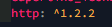 

## Langkah 3: Buka file main.dart 

### Soal 1: Tambahkan nama panggilan Anda pada title app sebagai identitas hasil pekerjaan Anda. 

Jawab: 
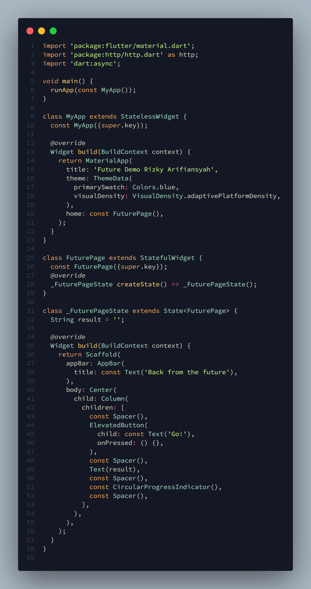 

## Langkah 4: Tambah method getData() 

### Soal 2: Carilah judul buku favorit Anda di Google Books, lalu ganti ID buku pada variabel path di kode tersebut.Kemudian cobalah akses di browser URI tersebut dengan lengkap seperti ini. Jika menampilkan data JSON, maka Anda telah berhasil. 

Jawab: 
 
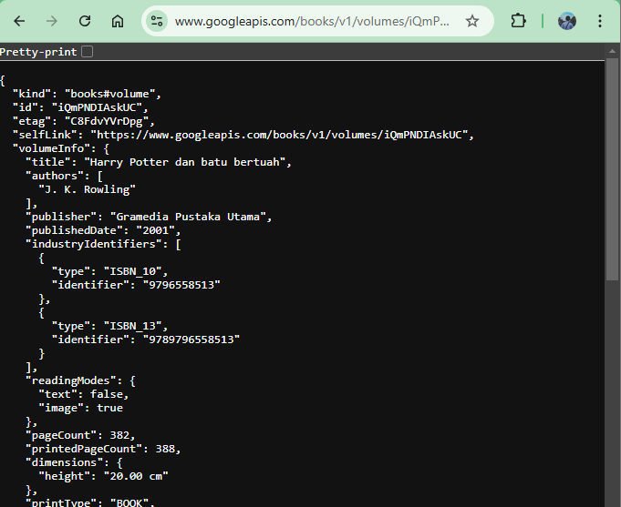 
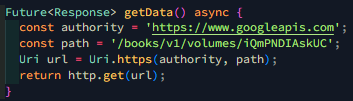 

## Langkah 5: Tambah kode di ElevatedButton 

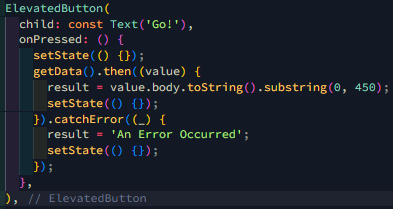 

### Soal 3: Jelaskan maksud kode langkah 5 tersebut terkait substring dan catchError! 

Jawab:Ketika tombol ditekan, fungsi getData() dipanggil untuk mengambil data buku, dan hanya 450 karakter pertama dari body respon yang ditampilkan menggunakan substring. Jika permintaan berhasil, hasilnya ditampilkan; jika terjadi kesalahan, blok catchError menangani error tersebut dengan menampilkan pesan 'An Error Occurred'. setState digunakan untuk memperbarui tampilan setelah hasil permintaan diterima atau jika terjadi kesalahan, dan CircularProgressIndicator ditambahkan sebagai indikator pemrosesan. 

Hasil Akhir: 
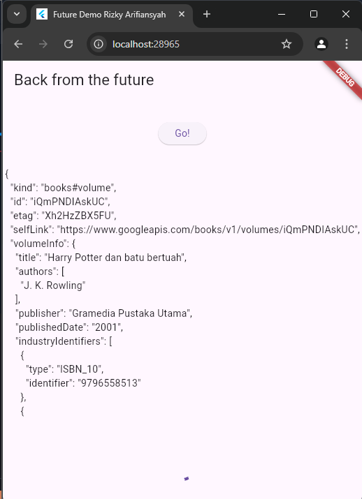 

# Praktikum 2: Menggunakan await/async untuk menghindari callbacks

## Langkah 1: Buat file main.dart 

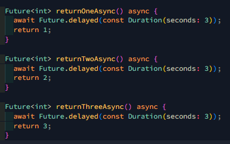 

## Langkah 2: Tambah method count() 

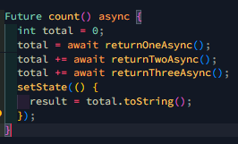 

## Langkah 3: Panggil count() 

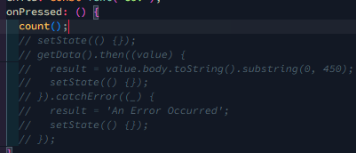 

## Langkah 4: Run 

## Soal 4: Jelaskan maksud kode langkah 1 dan 2 tersebut! 

Jawab: 

- `Future<int>` menunjukkan bahwa fungsi ini mengembalikan objek `Future` yang menghasilkan nilai integer (`int`).
- `await Future.delayed(const Duration(seconds: 3));` menyebabkan fungsi ini menunggu selama 3 detik (mewakili penundaan atau operasi asinkron lainnya).
- Setelah 3 detik, fungsi mengembalikan nilai integer (1, 2, atau 3 tergantung pada fungsinya).
- Fungsi `count` adalah fungsi asinkron yang tidak mengembalikan nilai (`void`).
- `int total = 0;` mendeklarasikan dan menginisialisasi variabel `total` dengan nilai 0.
- `total = await returnOneAsync();` menunggu sampai `returnOneAsync` selesai dan mengembalikan nilai 1, yang kemudian disimpan dalam `total`.
- `total += await returnTwoAsync();` menunggu sampai `returnTwoAsync` selesai dan menambahkan nilai 2 ke `total`.
- `total += await returnThreeAsync();` menunggu sampai `returnThreeAsync`selesai dan menambahkan nilai 3 ke `total`.
- Setelah semua operasi selesai, fungsi `setState` digunakan untuk memperbarui tampilan dengan mengubah nilai `result` menjadi total dari ketiga nilai tersebut dalam bentuk string.

Hasil akhir: 
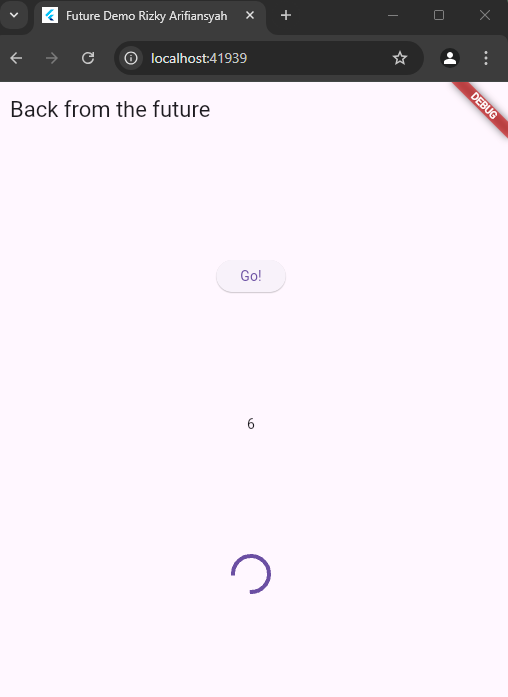 

# Praktikum 3: Menggunakan Completer di Future

## Langkah 1: Buka Main.dart 

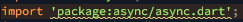 

## Langkah 2: Tambahkan Variable dan Method 

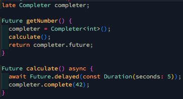 

## Langkah 3: Ganti isi kode onPressed 

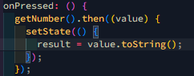 

## Langkah 4: Run 

## Soal 5: Jelaskan maksud kode langkah 2 tersebut! 

Jawab: 

- Completer dideklarasikan dengan keyword late, yang berarti bahwa variabel ini akan diinisialisasi nanti sebelum digunakan.
  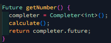 
- Fungsi ini mengembalikan sebuah Future.
- completer = Completer<int>(); membuat instance baru dari Completer yang menghasilkan Future yang akan menghasilkan nilai integer (int).
- calculate(); memanggil fungsi calculate untuk memulai perhitungan asinkron.
- return completer.future; mengembalikan Future yang terkait dengan Completer ini.

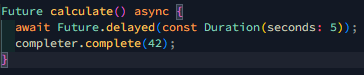 

- Fungsi ini menunggu selama 5 detik menggunakan Future.delayed.
- Setelah 5 detik, completer.complete(42); memanggil metode complete dari Completer untuk menyelesaikan Future yang terkait dan mengirimkan nilai 42.

Hasil: 
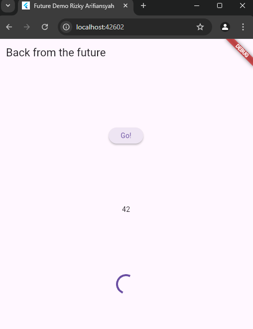 

## Langkah 5: Ganti method calculate() 

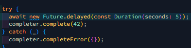 

## Langkah 6: Pindah ke onPressed 

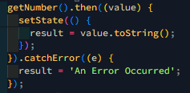 

### Soal 6: Jelaskan maksud perbedaan kode langkah 2 dengan langkah 5-6 tersebut! 

Jawab: 

- Kode pertama tidak memiliki penanganan kesalahan, sehingga jika terjadi kesalahan dalam operasi asinkron, aplikasi mungkin mengalami crash atau perilaku tidak terduga.
- Kode kedua menggunakan blok try-catch untuk menangani kesalahan dan menyelesaikan Completer dengan error, memungkinkan penanganan kesalahan lebih baik.
