# Praktikum 1: Mengunduh Data dari Web Service (API) 

## Langkah 1: Buat Project Baru 

 

## Langkah 2: Cek file pubspec.yaml 

 

## Langkah 3: Buka file main.dart 

### Soal 1: Tambahkan nama panggilan Anda pada title app sebagai identitas hasil pekerjaan Anda. 

Jawab: 
 

## Langkah 4: Tambah method getData() 

### Soal 2: Carilah judul buku favorit Anda di Google Books, lalu ganti ID buku pada variabel path di kode tersebut.Kemudian cobalah akses di browser URI tersebut dengan lengkap seperti ini. Jika menampilkan data JSON, maka Anda telah berhasil. 

Jawab: 
 
 
 

## Langkah 5: Tambah kode di ElevatedButton 

 

### Soal 3: Jelaskan maksud kode langkah 5 tersebut terkait substring dan catchError! 

Jawab:Ketika tombol ditekan, fungsi getData() dipanggil untuk mengambil data buku, dan hanya 450 karakter pertama dari body respon yang ditampilkan menggunakan substring. Jika permintaan berhasil, hasilnya ditampilkan; jika terjadi kesalahan, blok catchError menangani error tersebut dengan menampilkan pesan 'An Error Occurred'. setState digunakan untuk memperbarui tampilan setelah hasil permintaan diterima atau jika terjadi kesalahan, dan CircularProgressIndicator ditambahkan sebagai indikator pemrosesan. 

Hasil Akhir: 
 

# Praktikum 2: Menggunakan await/async untuk menghindari callbacks 

## Langkah 1: Buat file main.dart 

 

## Langkah 2: Tambah method count() 

 

## Langkah 3: Panggil count() 

 

## Langkah 4: Run 

## Soal 4: Jelaskan maksud kode langkah 1 dan 2 tersebut! 

Jawab: 

- `Future<int>` menunjukkan bahwa fungsi ini mengembalikan objek `Future` yang menghasilkan nilai integer (`int`).
- `await Future.delayed(const Duration(seconds: 3));` menyebabkan fungsi ini menunggu selama 3 detik (mewakili penundaan atau operasi asinkron lainnya).
- Setelah 3 detik, fungsi mengembalikan nilai integer (1, 2, atau 3 tergantung pada fungsinya).
- Fungsi `count` adalah fungsi asinkron yang tidak mengembalikan nilai (`void`).
- `int total = 0;` mendeklarasikan dan menginisialisasi variabel `total` dengan nilai 0.
- `total = await returnOneAsync();` menunggu sampai `returnOneAsync` selesai dan mengembalikan nilai 1, yang kemudian disimpan dalam `total`.
- `total += await returnTwoAsync();` menunggu sampai `returnTwoAsync` selesai dan menambahkan nilai 2 ke `total`.
- `total += await returnThreeAsync();` menunggu sampai `returnThreeAsync`selesai dan menambahkan nilai 3 ke `total`.
- Setelah semua operasi selesai, fungsi `setState` digunakan untuk memperbarui tampilan dengan mengubah nilai `result` menjadi total dari ketiga nilai tersebut dalam bentuk string.

Hasil akhir: 
 

# Praktikum 3: Menggunakan Completer di Future 

## Langkah 1: Buka Main.dart 

 

## Langkah 2: Tambahkan Variable dan Method 

 

## Langkah 3: Ganti isi kode onPressed 

 

## Langkah 4: Run 

## Soal 5: Jelaskan maksud kode langkah 2 tersebut! 

Jawab: 

- Completer dideklarasikan dengan keyword late, yang berarti bahwa variabel ini akan diinisialisasi nanti sebelum digunakan.
   
- Fungsi ini mengembalikan sebuah Future.
- completer = Completer<int>(); membuat instance baru dari Completer yang menghasilkan Future yang akan menghasilkan nilai integer (int).
- calculate(); memanggil fungsi calculate untuk memulai perhitungan asinkron.
- return completer.future; mengembalikan Future yang terkait dengan Completer ini.

 

- Fungsi ini menunggu selama 5 detik menggunakan Future.delayed.
- Setelah 5 detik, completer.complete(42); memanggil metode complete dari Completer untuk menyelesaikan Future yang terkait dan mengirimkan nilai 42.

Hasil: 
 

## Langkah 5: Ganti method calculate() 

 

## Langkah 6: Pindah ke onPressed 

 

### Soal 6: Jelaskan maksud perbedaan kode langkah 2 dengan langkah 5-6 tersebut! 

Jawab: 

- Kode pertama tidak memiliki penanganan kesalahan, sehingga jika terjadi kesalahan dalam operasi asinkron, aplikasi mungkin mengalami crash atau perilaku tidak terduga.
- Kode kedua menggunakan blok try-catch untuk menangani kesalahan dan menyelesaikan Completer dengan error, memungkinkan penanganan kesalahan lebih baik.

# Praktikum 4: Memanggil Future secara paralel 

## Langkah 1: Buka Main.dart 

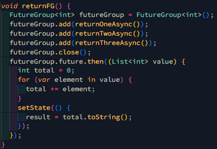 

## Langkah 2: Edit onPressed 

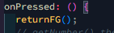 

## Langkah 3: Run 

### Soal 7: capture hasil praktikum 

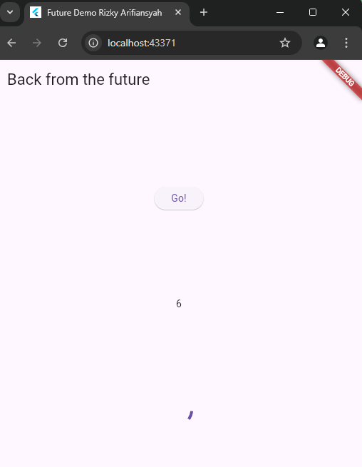 

## Langkah 4: Ganti variable futureGroup 

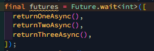 

## Soal 8: Jelaskan maksud perbedaan kode langkah 1 dan 4! 

Jawab: 
Perbedaan antara kode yang menggunakan FutureGroup dan Future.wait terletak pada cara mengelola beberapa operasi asinkron. FutureGroup adalah kelas khusus, mungkin berasal dari paket eksternal, yang memberikan kontrol lebih besar atas kelompok Future, memungkinkan penambahan Future secara dinamis dan pengelolaan hasil secara individual. Sementara itu, Future.wait adalah metode bawaan Dart yang menerima daftar Future dan mengembalikan sebuah Future baru yang selesai ketika semua Future dalam daftar selesai, dengan hasilnya dikumpulkan dalam sebuah List. FutureGroup lebih cocok untuk skenario yang membutuhkan kontrol lebih rinci, sedangkan Future.wait lebih sederhana dan langsung digunakan ketika hanya perlu menunggu beberapa Future selesai dan mengumpulkan hasilnya. 

# Praktikum 5: Menangani Respon Error pada async code 

## Langkah 1: Buka Main.dart 

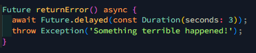 

## Langkah 2: ElevatedButton 

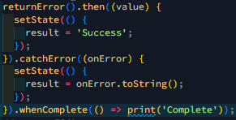 

## Langkah 3: Run 

### Soal 9: capture hasil praktikum 

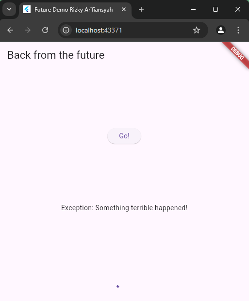 

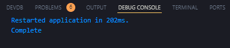 

## Langkah 4: Tambah method handleError 

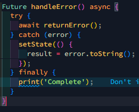 

### soal 10: Panggil method handleError() tersebut di ElevatedButton, lalu run. Apa hasilnya? Jelaskan perbedaan kode langkah 1 dan 4! 

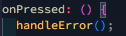 

Jawab:Perbedaan utama antara kedua kode tersebut terletak pada penanganan kesalahan. Kode pertama (returnError) hanya melemparkan exception tanpa penanganan, yang akan menyebabkan aplikasi terhenti jika terjadi error. Sementara kode kedua (handleError) menangani kesalahan dengan blok try-catch, di mana jika returnError melemparkan exception, kesalahan tersebut akan ditangkap dan ditangani dengan menampilkan pesan error melalui setState, yang memperbarui UI. Selain itu, kode kedua menggunakan blok finally, yang menjamin eksekusi kode setelah operasi selesai, baik berhasil maupun error, seperti mencetak "Complete". Dengan demikian, kode kedua lebih robust karena menangani kesalahan dan memastikan kelanjutan eksekusi program tanpa menyebabkan crash aplikasi. 

# Praktikum 6: Menggunakan Future dengan StatefulWidget 

## Langkah 1: install plugin geolocator 

 

## Langkah 2: Tambah permission GPS 

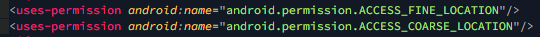 

## Langkah 3: Buat file geolocation.dart 

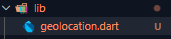 

## Langkah 4: Buat StatefulWidget 

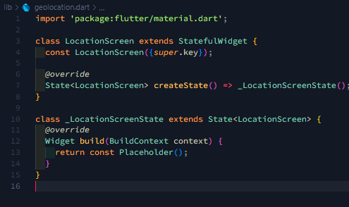 

## Langkah 5: Isi kode geolocation.dart 

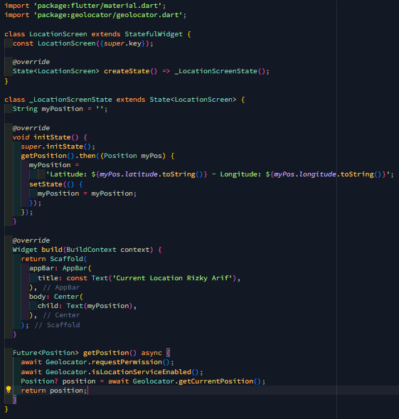 

### soal 11: Tambahkan nama panggilan Anda pada tiap properti title sebagai identitas pekerjaan Anda.

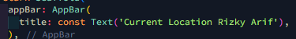 

## Langkah 6: Edit main.dart 

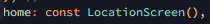 

## Langkah 7: Run 

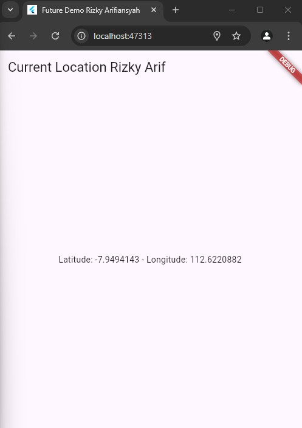 

## Langkah 8: Tambahkan animasi loading 

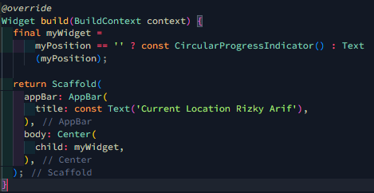 

### soal 12:

- Jika Anda tidak melihat animasi loading tampil, kemungkinan itu berjalan sangat cepat. Tambahkan delay pada method getPosition() dengan kode await Future.delayed(const Duration(seconds: 3)); 
  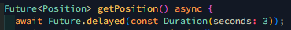 
- Apakah Anda mendapatkan koordinat GPS ketika run di browser? Mengapa demikian?
  Jawab: 
  Saat menjalankan aplikasi Flutter di browser, Anda tidak akan mendapatkan koordinat GPS karena browser tidak mendukung akses langsung ke hardware GPS perangkat. Geolocator, seperti banyak plugin lainnya, bergantung pada API yang menyediakan akses ke sensor perangkat (seperti GPS pada perangkat mobile atau tablet). Namun, browser tidak memberikan akses langsung ke informasi lokasi perangkat fisik melalui API yang sama yang digunakan di perangkat Android atau iOS. 

# Praktikum 7: Manajemen Future dengan FutureBuilder 

## Langkah 1: Modifikasi method getPosition() 

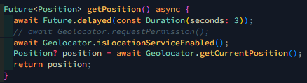 

## Langkah 2: Tambah Variable 

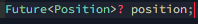 

## Langkah 3: Tambah initState() 

 

## Langkah 4: Edit method build() 

### Soal 13: Apakah ada perbedaan UI dengan praktikum sebelumnya? Mengapa demikian? 

Jawab: Tidak ada tetapi disini menggunakan FutureBuilder. FutureBuilder adalah widget yang dirancang untuk menangani operasi asinkron dan menampilkan data yang diperoleh secara dinamis. Dalam hal ini, saat aplikasi menunggu lokasi perangkat, akan muncul indikator pemuatan (loading) berupa CircularProgressIndicator. 

## Langkah 5: Tambah handling error 

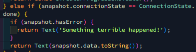

### Soal 14: Apakah ada perbedaan UI dengan langkah sebelumnya? Mengapa demikian? 

Jawab: Untuk UI nya tidak berubah tetapi disini membuat kode baru untuk penanganan error. Pada kode yang baru, terdapat penanganan kesalahan (error handling) menggunakan snapshot.hasError di dalam FutureBuilder. Jika terjadi kesalahan saat mengambil data lokasi, maka aplikasi akan menampilkan pesan error "Something terrible happened!".  

# Praktikum 8: Navigation route dengan Future Builder 

## Langkah 1: Buat file baru navigation_first.dart 

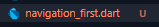 

## Langkah 2: Isi kode navigation_first.dart 

### Soal 15: Tambahkan nama panggilan Anda pada tiap properti title sebagai identitas pekerjaan Anda. Silakan ganti dengan warna tema favorit Anda.

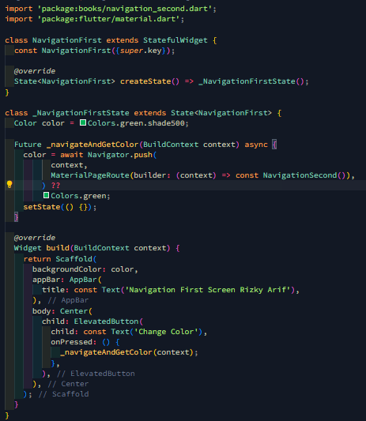

## Langkah 3: Tambah method di class \_NavigationFirstState 

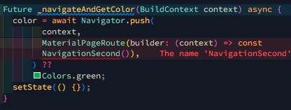 

## Langkah 4: Buat file baru navigation_second.dart 

 

## Langkah 5: Buat class NavigationSecond dengan StatefulWidget 

 

## Langkah 6: Edit main.dart 

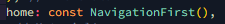 

## Langkah 7: Run 

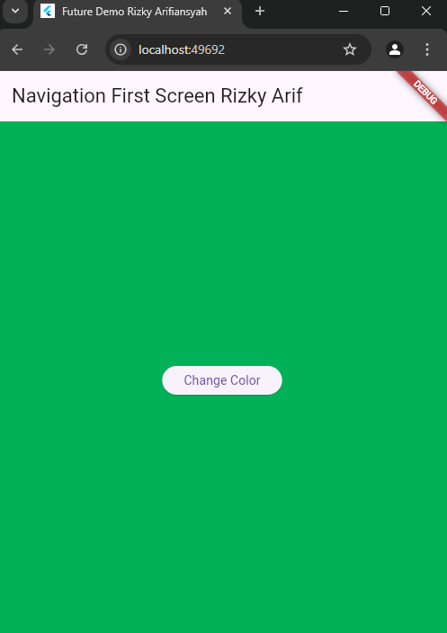 

### Soal 16: Cobalah klik setiap button, apa yang terjadi ? Mengapa demikian ? Gantilah 3 warna pada langkah 5 dengan warna favorit Anda! 

Jawab: Ketika kamu mengklik tombol di NavigationSecond, seperti tombol "Amber", "Purple", atau "Yellow", setiap tombol akan mengubah nilai variabel color menjadi warna tertentu (misalnya Colors.amber.shade200 untuk tombol "Amber") dan kemudian kembali ke NavigationFirst dengan mengirimkan nilai warna tersebut menggunakan Navigator.pop(context, color). Di NavigationFirst, nilai warna yang dikirimkan akan diterima oleh Navigator.push() dan mengubah background color aplikasi menggunakan setState(), sesuai dengan warna yang dipilih di NavigationSecond. Namun, terdapat bug di NavigationSecond, di mana variabel color tidak diberi nilai awal, yang bisa menyebabkan error. Seharusnya, variabel color diberi nilai default (misalnya color = Colors.green) untuk menghindari masalah tersebut. Dengan perbaikan ini, setelah menekan tombol di NavigationSecond, aplikasi akan kembali ke NavigationFirst dengan background yang berubah sesuai dengan pilihan warna dari tombol yang ditekan. 

# Praktikum 9: Memanfaatkan async/await dengan widget dialog 

## Langkah 1: Buat file baru dialog.dart 

 

## Langkah 2: isi kode navigation_dialog.dart \

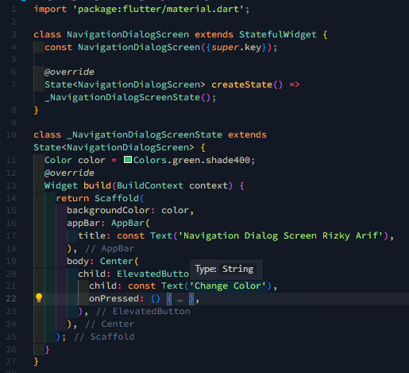

## Langkah 3: Tambah method async 

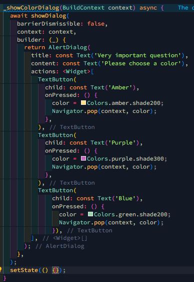 

## Langkah 4: Panggil method di ElevatedButton 

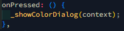 

## Langkah 5: Edit main.dart 

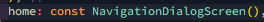 

## Langkah 6: Run 

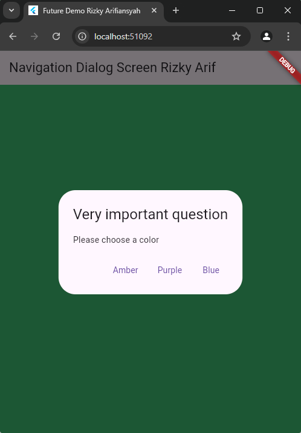 

### Soal 17: Cobalah klik setiap button, apa yang terjadi ? Mengapa demikian ?

Jawab: Ketika mengklik setiap tombol ("Amber", "Purple", atau "Blue") pada dialog di NavigationDialogScreen, masing-masing tombol akan mengubah nilai variabel color menjadi warna tertentu (misalnya Colors.amber.shade200 untuk tombol "Amber"). Setelah itu, dialog akan ditutup menggunakan Navigator.pop(context, color), yang mengirimkan nilai warna yang dipilih kembali ke NavigationDialogScreen. Setelah dialog ditutup, setState() dipanggil untuk memperbarui tampilan dan mengganti latar belakang layar menjadi warna yang dipilih. Hal ini terjadi karena setState() memberitahukan Flutter bahwa ada perubahan dalam status yang perlu diperbarui di UI. Jadi, ketika tombol dipilih, warna latar belakang aplikasi akan berubah sesuai dengan pilihan warna yang diinginkan oleh pengguna. 
