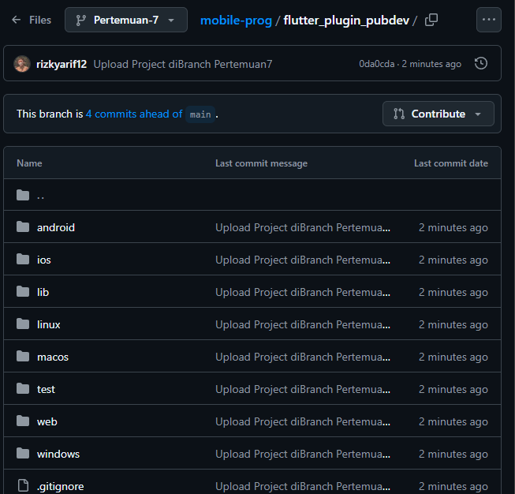
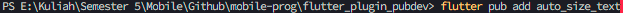
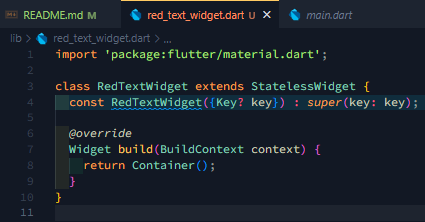
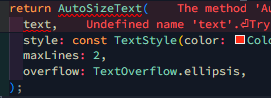
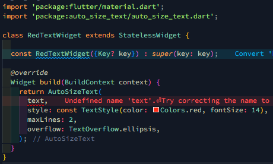
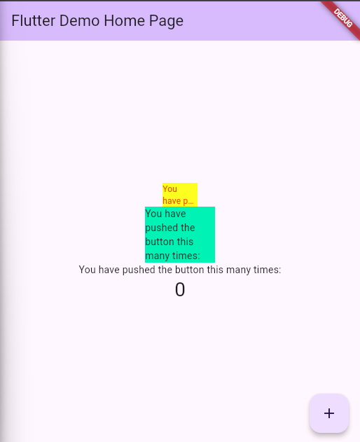

# Praktikum Menerapkan Plugin di Project Flutter

## Langkah 1 : Buat Project Baru

  

## Langkah 2 : Menambahkan Plugin

  

## Langkah 3 : Buat File red_text_widget.dart

  

## Langkah 4 : Tambah Widget AutoSizeTex

Error karena belum import package auto_size_text
Sebelum:
  
Sesudah:
  

## Langkah 5 : Buat Variable Text dan Parameter di contruktor

  

## Langkah 6 : Tambahkan widget di main.dart

  

# Tugas Praktikum

## 2. Jelaskan maksud dari langkah 2 pada praktikum tersebut! 

Jawab : Perintah `flutter pub add auto_size_text` digunakan untuk menambahkan paket `auto_size_text` ke dalam proyek Flutter kita. Perintah ini secara otomatis akan mengedit file `pubspec.yaml` dan menambahkan dependensi yang diperlukan, kemudian mengunduh paket tersebut. 

## 3. Jelaskan maksud dari langkah 5 pada praktikum tersebut! 

Jawab : Langkah 5 pada praktikum bertujuan untuk mengatasi error "Undefined name `text`" dengan menambahkan variabel text sebagai properti kelas `RedTextWidget` dan menjadikannya parameter pada constructor. Ini dilakukan dengan mendeklarasikan text sebagai variabel final dalam kelas dan menambahkannya sebagai parameter `required` dalam constructor, memastikan bahwa setiap instance dari RedTextWidget harus diberikan nilai text saat diinisialisasi. Hal ini memungkinkan penggunaan properti text di dalam metode build untuk menampilkan teks yang diberikan melalui widget `AutoSizeText`. 

## 4. Pada langkah 6 terdapat dua widget yang ditambahkan, jelaskan fungsi dan perbedaannya! 

Jawab : Kedua `Container` tersebut digunakan untuk mendemonstrasikan perbedaan dalam menampilkan teks menggunakan dua pendekatan yang berbeda. `RedTextWidget` dengan `AutoSizeText` memberikan kemampuan penyesuaian ukuran teks secara otomatis untuk muat dalam ruang yang terbatas atau menyesuaikan dengan ukuran lebar widget sehingga teks akan terpotong, sedangkan widget `Text` standar menampilkan teks tanpa penyesuaian ukuran otomatis, mengandalkan ruang yang lebih besar agar teks tidak terpotong. 

## 5. Jelaskan maksud dari tiap parameter yang ada di dalam plugin auto_size_text berdasarkan tautan pada dokumentasi ini ! 

Jawab :
| Parameter | Keterangan |
|-----------|------------|
| key* | Mengontrol bagaimana satu widget menggantikan widget lain di dalam pohon widget.|
| textKey | Menetapkan kunci untuk widget Teks yang dihasilkan. |
| style* | Jika tidak null, gaya yang digunakan untuk teks ini. |
| minFontSize | Batas ukuran teks minimum yang digunakan saat menyesuaikan ukuran teks secara otomatis. Diabaikan jika presetFontSizes diatur.|
| maxFontSize | Batas ukuran teks maksimum yang digunakan saat menyesuaikan ukuran teks secara otomatis. Diabaikan jika presetFontSizes diatur. |
| stepGranularity | Ukuran langkah di mana ukuran font disesuaikan dengan batasan. |
| presetFontSizes | Menentukan semua ukuran font yang mungkin. Penting: presetFontSizes harus dalam urutan menurun. |
| group | Menyinkronkan ukuran beberapa AutoSizeText. |
| textAlign* | Bagaimana teks harus diratakan secara horizontal. |
| textDirection* | Arah teks. Ini memutuskan bagaimana nilai textAlign seperti TextAlign.start dan TextAlign.end ditafsirkan. |
| locale* | Digunakan untuk memilih font ketika karakter Unicode yang sama dapat dirender berbeda, tergantung pada lokal. |
| softWrap* | Apakah teks harus terputus pada jeda baris lunak. |
| wrapWords | Apakah kata-kata yang tidak muat dalam satu baris harus dibungkus. Default-nya true untuk berperilaku seperti Text. |
| overflow* | Bagaimana visual overflow harus ditangani. |
| overflowReplacement | Jika teks meluap dan tidak muat dalam batasnya, widget ini ditampilkan sebagai gantinya. |
| textScaleFactor* | Jumlah piksel font untuk setiap piksel logis. Juga mempengaruhi minFontSize, maxFontSize, dan presetFontSizes. |
| maxLines | Jumlah maksimum baris opsional untuk rentang teks. |
| semanticsLabel\* | Label semantik alternatif untuk teks ini. |
