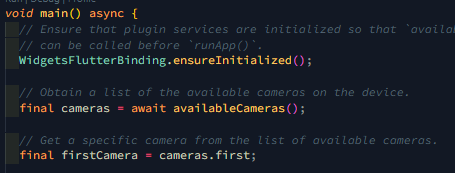
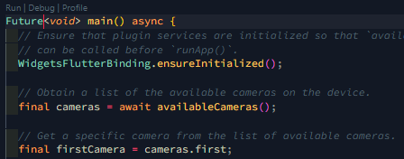
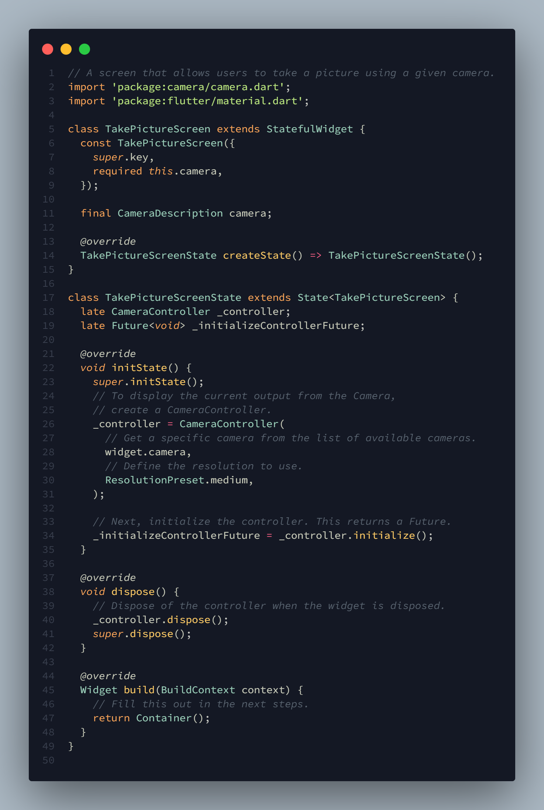
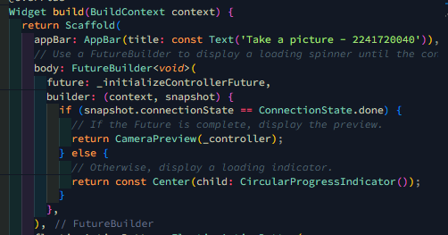
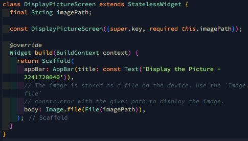
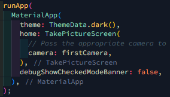
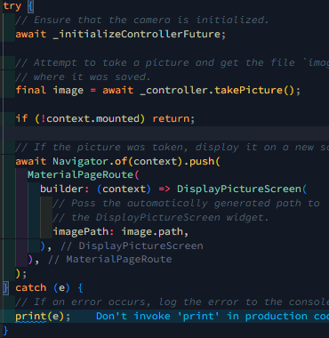

# Praktikum 1 : Mengambil Foto dengan Kamera di Flutter

## Langkah 1: Buat Project Baru 

## Langkah 2: Tambah Dependensi yang di perlukan 

## Langkah 3: Ambil Sensor Kamera dari device 

 

 

## Langkah 4: Buat dan inisialisasi CameraController 

 

## Langkah 5: Gunakan CameraPreview untuk menampilkan preview foto 

 

## Langkah 6: Ambil foto dengan CameraController 

 

## Langkah 7: Buat widget baru DisplayPictureScreen 

 

## Langkah 8: Edit main.dart 

 

## Langkah 9: Menampilkan hasil foto 

 

Hasil: 
