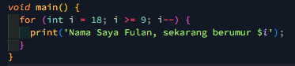
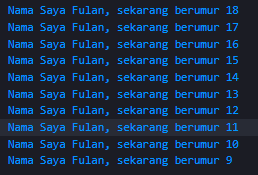

# Laporan Praktikum Modul 1 dan Modul 2

Nama : Rizky Arifiansyah
 
Nomor : 24
 
Kelas : TI-3B

## Soal 1

Modifikasilah kode pada baris 3 di VS Code atau Editor Code favorit Anda berikut ini agar mendapatkan keluaran (output) sesuai yang diminta!

Output yang diminta:

## Soal 2

Mengapa sangat penting untuk memahami bahasa pemrograman Dart sebelum kita menggunakan framework Flutter ? Jelaskan! 

<b>Jawab :</b> Karena Keseluruhan pengembangan framework Flutter memerlukan pengetahuan mendalam dan fungsionalitas bahasa Dart. Kode aplikasi, kode plugin, dan manajemen ketergantungan semuanya menggunakan bahasa Dart dan fitur-fiturnya. Pemahaman yang kuat tentang dasar-dasar Dart akan meningkatkan produktivitas Flutter kita dan membuat kita nyaman dengan pengembangan Flutter.

## Soal 3

Rangkumlah materi dari codelab ini menjadi poin-poin penting yang dapat Anda gunakan untuk membantu proses pengembangan aplikasi mobile menggunakan framework Flutter. 

<b>Jawab :</b>

1. Pemahaman Bahasa Pemrograman Dart: 
   • Dart adalah bahasa utama untuk pengembangan Flutter. Memahami sintaks dan konsep dasar Dart akan memudahkan kita dalam menggunakan Flutter. 
   • Dart memiliki operator standar seperti bahasa pemrograman lain (C, JavaScript) sehingga akan lebih mudah dipelajari jika sudah familiar dengan bahasa-bahasa tersebut. 
   • Dart mendukung built-in types dan control flow yang umum ditemukan dalam bahasa tingkat tinggi.
2. Object-Oriented Programming (OOP) di Dart: 
   • Dart adalah bahasa OOP yang mendukung konsep seperti encapsulation, inheritance, composition, abstraction, dan polymorphism. 
   • Objek dalam Dart menyimpan data (fields) dan kode (methods), dan objek-objek ini dibuat dari class. 
   • Jika sudah memahami OOP dalam bahasa lain seperti Java, konsep OOP di Dart akan sangat mirip.
3. Operator dalam Dart: 
   • Arithmetic Operators: Mendukung operasi aritmatika dasar seperti `+, -, \*, /, dan ~/` (untuk pembagian bilangan bulat). 
   • Increment and Decrement Operators: Operator `++` dan `--` untuk penambahan dan pengurangan variabel. 
   • Equality and Relational Operators: Operator seperti `==, !=, >, <, >=, <=` untuk membandingkan nilai. 
   • Logical Operators: `!, ||, &&` untuk operasi logika.
4. Main Function dalam Dart: 
   • Function main() adalah titik awal eksekusi dalam program Dart, mirip dengan bahasa pemrograman lainnya. 
   • Tipe data yang dikembalikan oleh function perlu didefinisikan (contoh: void untuk function yang tidak mengembalikan data). 
   • Function dapat menerima parameter untuk memproses data yang diberikan.
5. Keunikan Dart Dibandingkan Bahasa Lain: 
   • Dart tidak membandingkan referensi/alamat memori dengan operator `==`, melainkan membandingkan isi dari variabel tersebut. 
   • Dart tidak memerlukan operator `===` seperti di JavaScript karena memiliki type safety bawaan. 
   • Semua tipe data di Dart adalah objek, sehingga operator dapat diimplementasikan sebagai method dalam class.
6. Manfaat Mempelajari Dart untuk Flutter: 
   • Dengan memahami Dart, kita dapat lebih mudah memahami bagaimana Flutter bekerja dan mengoptimalkan penggunaan widget. 
   • Memahami konsep OOP dalam Dart memudahkan kita dalam membuat aplikasi yang modular dan mudah di-maintain. 
   • Dart memungkinkan kita untuk memanfaatkan fitur-fitur language-specific yang dapat meningkatkan kinerja dan efisiensi aplikasi Flutter kita.
