# Laporan Praktikum Pertemuan 3

## Modul 3

## Praktikum 1: Menerapkan Control Flows ("if/else")

Nama : Rizky Arifiansyah
 
Nomor : 24
 
Kelas : TI-3B

### Langkah 1

Ketik atau salin kode program berikut ke dalam fungsi main().
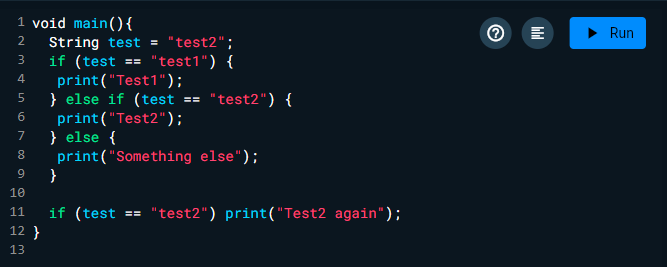

### Langkah 2

Silakan coba eksekusi (Run) kode pada langkah 1 tersebut. Apa yang terjadi? Jelaskan!

Jawab :
Ketika kode Dart tersebut dieksekusi, pertama, variabel test diinisialisasi dengan nilai "test2". Blok if pertama memeriksa nilai variabel test; karena nilainya "test2", pernyataan print("Test2") dieksekusi, menghasilkan output "Test2". Blok else diabaikan karena kondisi sebelumnya sudah terpenuhi. Selanjutnya, terdapat pernyataan if yang memeriksa apakah test bernilai "test2", yang juga benar, sehingga pernyataan print("Test2 again") dieksekusi, menghasilkan output "Test2 again". Jadi, output akhir dari eksekusi kode ini adalah "Test2" diikuti oleh "Test2 again".

### Langkah 3

Apa yang terjadi ? Jika terjadi error, silakan perbaiki namun tetap menggunakan if/else

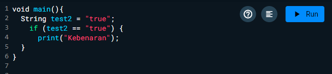

### Hasil

## Praktikum 2: Menerapkan Perulangan "while" dan "do-while"

### Langkah 1

Ketik atau salin kode program berikut ke dalam fungsi main().

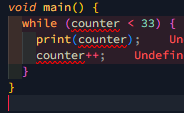

### Langkah 2

Silakan coba eksekusi (Run) kode pada langkah 1 tersebut. Apa yang terjadi? Jelaskan! Lalu perbaiki jika terjadi error.

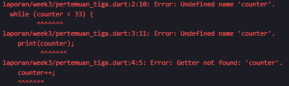

Jawab : maka akan terjadi error undefine name 'counter'. Karena variable counter belum di deklarasikan

Hasil setelah di perbaiki

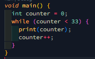

Hasil

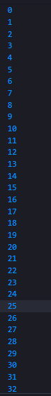

### Langkah 3

Tambahkan kode program berikut, lalu coba eksekusi (Run) kode Anda.

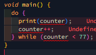

Jawab : maka akan terjadi error undefine name 'counter'. Karena variable counter belum di deklarasikan

Hasil
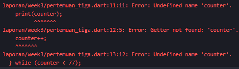

Hasil setelah di perbaiki
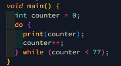

Hasil
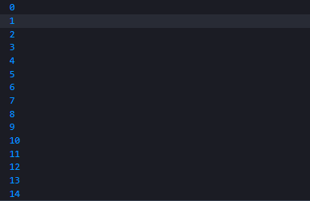
Maka akan melakukan perulangan sampai kurang dari 77

## Praktikum 3: Menerapkan Perulangan "for" dan "break-continue"

### Langkah 1

Ketik atau salin kode program berikut ke dalam fungsi main().

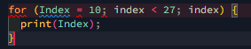

### Langkah 2

Silakan coba eksekusi (Run) kode pada langkah 1 tersebut. Apa yang terjadi? Jelaskan! Lalu perbaiki jika terjadi error.

Jawab : Maka akan terjadi error dimana variable index belum di deklarasikan serta belum ditambah kan `++` setelah index.

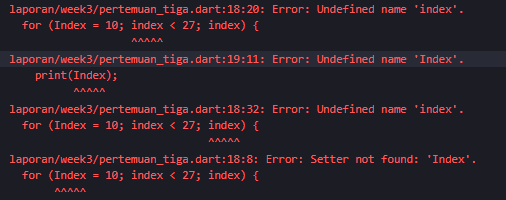

Hasil setelah di perbaiki
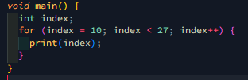

Hasil

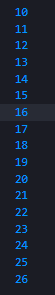

### Langkah 3

Tambahkan kode program berikut di dalam for-loop, lalu coba eksekusi (Run) kode Anda.

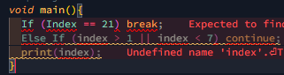

Hasil Setelah di perbaiki
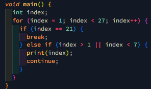

Hasil
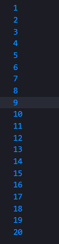

## TUGAS PRAKTIKUM

1. Silakan selesaikan Praktikum 1 sampai 3, lalu dokumentasikan berupa screenshot hasil pekerjaan beserta penjelasannya!
2. Buatlah sebuah program yang dapat menampilkan bilangan prima dari angka 0 sampai 201 menggunakan Dart. Ketika bilangan prima ditemukan, maka tampilkan nama lengkap dan NIM Anda.

Jawab :

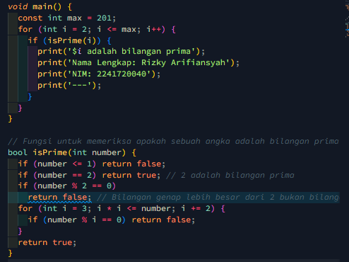

Hasil

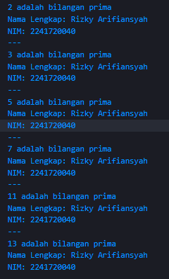
