# Laporan Praktikum Week 4

## Praktikum 1 : Eksperimen Tipe Data List

Selesaikan langkah-langkah praktikum berikut ini menggunakan VS Code atau Code Editor favorit Anda.

### Langkah 1 :

Ketik atau salin kode program berikut ke dalam void main().

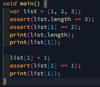

### Langkah 2 :

Silakan coba eksekusi (Run) kode pada langkah 1 tersebut. Apa yang terjadi? Jelaskan!

Jawab : Ketika kode di atas dieksekusi, list dengan elemen [1, 2, 3] diinisialisasi, kemudian panjang list diperiksa menggunakan assert untuk memastikan nilainya 3 dan elemen kedua diperiksa untuk memastikan nilainya 2. Keduanya lulus tanpa masalah. Selanjutnya, panjang list dicetak menghasilkan 3 dan elemen kedua dicetak menghasilkan 2. Elemen kedua dari list kemudian diubah menjadi 1, sehingga list berubah menjadi [1, 1, 3]. Perubahan ini diperiksa dengan assert untuk memastikan elemen kedua sekarang bernilai 1, yang juga lulus tanpa masalah. Terakhir, elemen kedua dicetak kembali menghasilkan 1. Jadi, output lengkap dari kode ini adalah 3, 2, dan 1.

### Langkah 3:

Ubah kode pada langkah 1 menjadi variabel final yang mempunyai index = 5 dengan default value = null. Isilah nama dan NIM Anda pada elemen index ke-1 dan ke-2. Lalu print dan capture hasilnya.

Apa yang terjadi ? Jika terjadi error, silakan perbaiki.

Jawab :

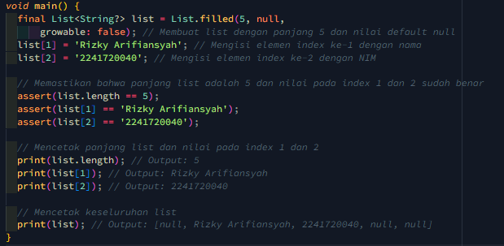

Hasil:

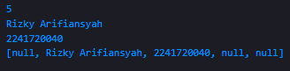

## Praktikum 2: Eksperimen Tipe Data Set

Selesaikan langkah-langkah praktikum berikut ini menggunakan VS Code atau Code Editor favorit Anda.

### Langkah 1:

Ketik atau salin kode program berikut ke dalam fungsi main().
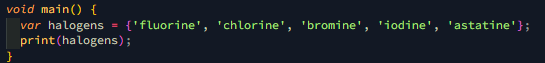

### Langkah 2:

Silakan coba eksekusi (Run) kode pada langkah 1 tersebut. Apa yang terjadi? Jelaskan! Lalu perbaiki jika terjadi error.
Jawab : Ketika kode var halogens = {'fluorine', 'chlorine', 'bromine', 'iodine', 'astatine'}; print(halogens); dijalankan, sebuah set yang berisi elemen-elemen string diciptakan dan dicetak ke konsol. Dalam Dart, tanda kurung kurawal {} dengan elemen di dalamnya menandakan pembuatan sebuah set, kecuali jika secara eksplisit didefinisikan sebagai Map. Kode ini akan berjalan tanpa error dan mencetak isi set halogens, yang hasilnya {fluorine, chlorine, bromine, iodine, astatine}, dengan urutan elemen yang tidak terdefinisi karena set tidak memiliki urutan yang pasti.

### Langkah 3:

Tambahkan kode program berikut, lalu coba eksekusi (Run) kode Anda.

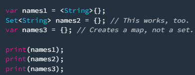

Apa yang terjadi ? Jika terjadi error, silakan perbaiki namun tetap menggunakan ketiga variabel tersebut. Tambahkan elemen nama dan NIM Anda pada kedua variabel Set tersebut dengan dua fungsi berbeda yaitu .add() dan .addAll(). Untuk variabel Map dihapus, nanti kita coba di praktikum selanjutnya.

Dokumentasikan code dan hasil di console, lalu buat laporannya.

Jawab :

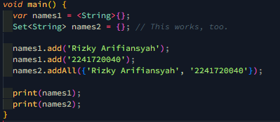

Hasil:

## Praktikum 3: Eksperimen Tipe Data Maps

### Langkah 1:

Ketik atau salin kode program berikut ke dalam fungsi main().

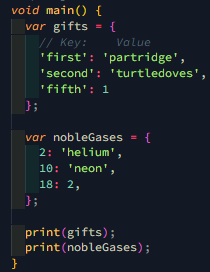

### Langkah 2:

Silakan coba eksekusi (Run) kode pada langkah 1 tersebut. Apa yang terjadi? Jelaskan! Lalu perbaiki jika terjadi error.

Jawab : Saat menjalankan kode di atas, program akan mencetak dua map yaitu gifts dan nobleGases. Namun, terdapat ketidakkonsistenan tipe data pada nilai-nilai di kedua map tersebut. Pada map gifts, nilai untuk key 'fifth' adalah angka (1), sementara nilai lainnya adalah string seperti 'partridge' dan 'turtledoves'. Begitu juga pada map nobleGases, nilai untuk key 18 adalah angka (2), sedangkan nilai lainnya adalah string seperti 'helium' dan 'neon'. Meskipun Dart memperbolehkan penggunaan tipe data yang berbeda dalam sebuah map, hal ini bisa menyebabkan kebingungan atau error di kemudian hari. Untuk membuat kode lebih konsisten dan mudah dipahami, sebaiknya semua nilai dalam masing-masing map menggunakan tipe data yang sama, misalnya semua string atau semua integer.

### Langkah 3:

Tambahkan kode program berikut, lalu coba eksekusi (Run) kode Anda.

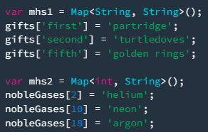

Apa yang terjadi ? Jika terjadi error, silakan perbaiki.

Tambahkan elemen nama dan NIM Anda pada tiap variabel di atas (gifts, nobleGases, mhs1, dan mhs2). Dokumentasikan hasilnya dan buat laporannya!

Jawab :

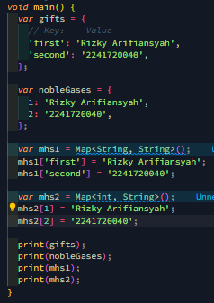

Hasil:

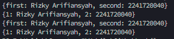

## Praktikum 4: Eksperimen Tipe Data List: Spread dan Control-flow Operators

### Langkah 1:

Ketik atau salin kode program berikut ke dalam fungsi main().

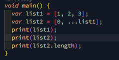

### Langkah 2:

Silakan coba eksekusi (Run) kode pada langkah 1 tersebut. Apa yang terjadi? Jelaskan! Lalu perbaiki jika terjadi error.

Jawab : Kode tersebut berjalan tanpa error dan menggunakan operator spread (...) untuk menyalin elemen dari list1 ke list2. list1 berisi [1, 2, 3], sementara list2 menambahkan angka 0 di awal dan kemudian menyebarkan elemen-elemen dari list1, sehingga hasilnya menjadi [0, 1, 2, 3]. Saat mencetak panjang list2 dengan list2.length, hasilnya adalah 4, karena terdapat empat elemen dalam list tersebut. Kode ini menunjukkan cara menggunakan operator spread untuk menggabungkan atau menyalin elemen-elemen dari list lain.

### Langkah 3:

Tambahkan kode program berikut, lalu coba eksekusi (Run) kode Anda.

Apa yang terjadi ? Jika terjadi error, silakan perbaiki.

Tambahkan variabel list berisi NIM Anda menggunakan Spread Operators. Dokumentasikan hasilnya dan buat laporannya!

Jawab :

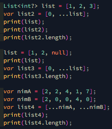

Hasil :

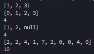

### Langkah 4:

Tambahkan kode program berikut, lalu coba eksekusi (Run) kode Anda.

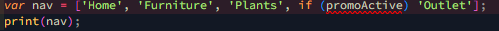

Apa yang terjadi ? Jika terjadi error, silakan perbaiki. Tunjukkan hasilnya jika variabel promoActive ketika true dan false.

Jawab : Maka terjadi error, karena variabel promoActive tidak memiliki nilai boolean.

Setelah di perbaiki, hasilnya adalah [Home, Furniture, Plants, Outlet].
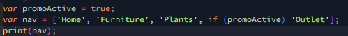

Hasil :

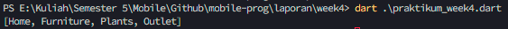

### Langkah 5:

Tambahkan kode program berikut, lalu coba eksekusi (Run) kode Anda.

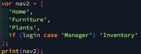

Apa yang terjadi ? Jika terjadi error, silakan perbaiki. Tunjukkan hasilnya jika variabel login mempunyai kondisi lain.

Jawab : Maka terjadi error, karena variabel login tidak memiliki nilai string.

Setelah di perbaiki, hasilnya adalah [Home, Furniture, Plants, Inventory].

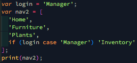

Hasil :

### Langkah 6:

Tambahkan kode program berikut, lalu coba eksekusi (Run) kode Anda.

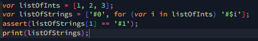

Apa yang terjadi ? Jika terjadi error, silakan perbaiki. Jelaskan manfaat Collection For dan dokumentasikan hasilnya.

Hasil :

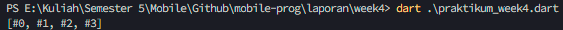

Jawab : Pada kode tersebut, listOfInts adalah daftar berisi [1, 2, 3]. Kemudian, listOfStrings menggunakan Collection For untuk membuat daftar baru yang dimulai dengan '#0' dan diikuti oleh elemen '#1', '#2', dan '#3', yang dihasilkan dari iterasi listOfInts. Pernyataan assert digunakan untuk memeriksa apakah elemen kedua listOfStrings adalah '#1', dan print mencetak daftar tersebut. Manfaat Collection For dalam Dart adalah memungkinkan penulisan kode yang lebih ringkas dan mudah dibaca, memudahkan pemeliharaan, serta menciptakan koleksi secara efisien tanpa loop tambahan.

## Praktikum 5: Eksperimen Tipe Data Records

### Langkah 1:

Ketik atau salin kode program berikut ke dalam fungsi main().

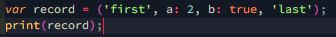

### Langkah 2:

Silakan coba eksekusi (Run) kode pada langkah 1 tersebut. Apa yang terjadi? Jelaskan! Lalu perbaiki jika terjadi error.

Jawab : Kode tersebut berjalan tanpa error dan menggunakan Records.

Hasil :

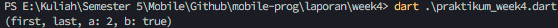

### Langkah 3:

Tambahkan kode program berikut di luar scope void main(), lalu coba eksekusi (Run) kode Anda.

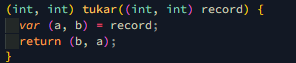

Apa yang terjadi ? Jika terjadi error, silakan perbaiki. Gunakan fungsi tukar() di dalam main() sehingga tampak jelas proses pertukaran value field di dalam Records.

Jawab : Iya terjadi error.

Setelah di perbaiki :

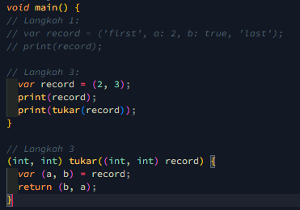

Hasil :

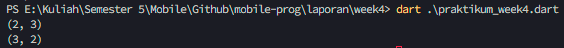

### Langkah 4:

Tambahkan kode program berikut di dalam scope void main(), lalu coba eksekusi (Run) kode Anda.

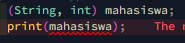

Apa yang terjadi ? Jika terjadi error, silakan perbaiki. Inisialisasi field nama dan NIM Anda pada variabel record mahasiswa di atas. Dokumentasikan hasilnya dan buat laporannya!

Jawab : Terjadi error karena record tidak memiliki field atau isi.

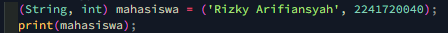

Hasil :

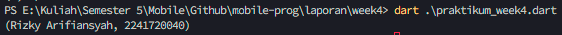

### Langkah 5:

Tambahkan kode program berikut di dalam scope void main(), lalu coba eksekusi (Run) kode Anda.

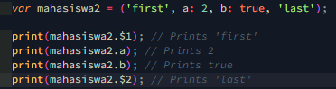

Apa yang terjadi ? Jika terjadi error, silakan perbaiki. Gantilah salah satu isi record dengan nama dan NIM Anda, lalu dokumentasikan hasilnya dan buat laporannya!

Jawab : Tidak terjadi error.

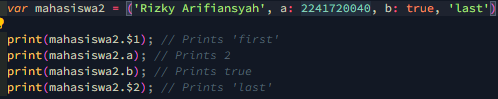

Hasil :

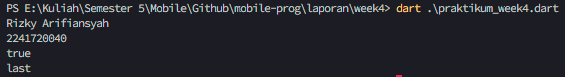

## TUGAS PRAKTIKUM

1. Silakan selesaikan Praktikum 1 sampai 5, lalu dokumentasikan berupa screenshot hasil pekerjaan Anda beserta penjelasannya!
2. Jelaskan yang dimaksud Functions dalam bahasa Dart!

   Jawab : Functions dalam bahasa Dart adalah blok kode yang dapat dijalankan ketika dipanggil. Mereka digunakan untuk mengelompokkan logika yang dapat dieksekusi berulang kali di berbagai tempat dalam program. Functions di Dart dapat menerima parameter, mengembalikan nilai, dan mendukung berbagai fitur seperti fungsi anonim dan fungsi sebagai objek kelas pertama.

3. Jelaskan jenis-jenis parameter di Functions beserta contoh sintaksnya!

Jawab :

`Positional Parameters:` Didefinisikan berdasarkan urutan dan wajib diisi. Contoh sintaks: `(nama, umur)`.

`Named Parameters:` Diberikan nama dan dapat diisi dalam urutan apapun, sering digunakan dengan {} dan bersifat opsional. `{nama: Rizky, umur: 22}`.

`Optional Positional Parameters:`Ditandai dengan [] dan bersifat opsional. `void greet(String name, [int age = 30]) {
  print('Hello $name, you are $age years old.');
}`

4. Jelaskan maksud Functions sebagai first-class objects beserta contoh sintaknya!

Jawab : Functions sebagai first-class objects berarti functions dapat disimpan dalam variabel dan dilewatkan sebagai parameter.
Contoh sintak :
`void printMessage() {
  print('Hello, Dart!');
}`

`void executeFunction(void Function() func) {
  func();
}`

`void main() {
  var myFunction = printMessage;
  executeFunction(myFunction);
}`

`Penjelasan:` Fungsi printMessage disimpan dalam variabel myFunction dan dilewatkan sebagai parameter ke fungsi executeFunction, yang kemudian memanggilnya.

5. Apa itu Anonymous Functions? Jelaskan dan berikan contohnya!

Jawab : Anonymous Functions adalah functions tanpa nama yang sering digunakan untuk tugas yang sederhana dan sekali pakai.

Contoh sintaks:

`void main() {
  var list = ['apples', 'bananas', 'oranges'];
  list.forEach((item) {
    print(item);
  });
}`

`Penjelasan:` Fungsi anonim diteruskan ke metode forEach untuk mencetak setiap elemen dalam list.

6. Jelaskan perbedaan Lexical scope dan Lexical closures! Berikan contohnya!

Jawab :

`Lexical Scope:` Variabel yang didefinisikan dalam suatu fungsi hanya bisa diakses dalam fungsi itu dan fungsi-fungsi bersarang di dalamnya.
contoh sintaks :
`void main() {
  var name = 'Dart';
  void display() {
    print(name); // 'name' bisa diakses di sini
  }
  display();
}`
`Penjelasan:` Fungsi display dapat mengakses variabel name karena berada dalam ruang lingkup yang sama.

`Lexical Closures:` Fungsi yang menangkap variabel dari ruang lingkup sekitarnya di mana fungsi tersebut didefinisikan.
contoh sintaks :
`Function makeAdder(int addBy) {
  return (int i) => addBy + i;
}`

`void main() {
  var add2 = makeAdder(2);
  print(add2(3)); // 5
}`
`Penjelasan:` Fungsi anonim yang dikembalikan oleh makeAdder menangkap variabel addBy dari ruang lingkup sekitarnya.

7. Jelaskan dengan contoh cara membuat return multiple value di Functions!

Jawab : Contoh disini saya menggunakan map

`Map<String, int> swap(int a, int b) {
  return {'first': b, 'second': a};
}`

`void main() {
  var result = swap(1, 2);
  print(result); // {first: 2, second: 1}
}`

Fungsi swap menukar nilai a dan b, lalu mengembalikannya dalam sebuah map dengan kunci first dan second.
