# Praktikum 1 : Dasar State dengan Model-View

## Langkah 1 : Buat Project Baru 

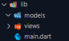 

## Langkah 2 : Membuat model task.dart 

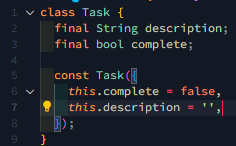 

## Langkah 3 : Buat file plan.dart 

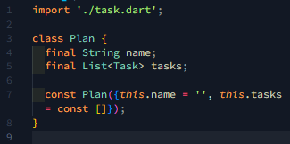 

## Langkah 4 : Buat file data_layer.dart 

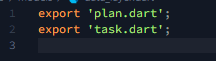 

## Langkah 5 : Pindah ke file main.dart 

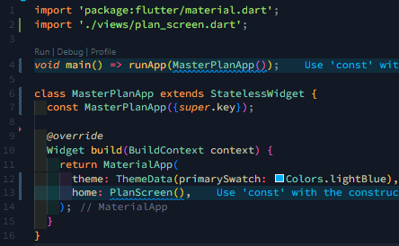 

## Langkah 6 : Buat plan_screen.dart 

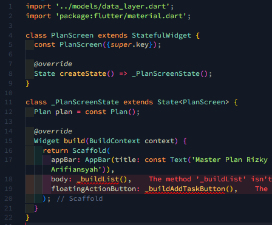 

## Langkah 7 : buat method \_buildAddTaskButton 

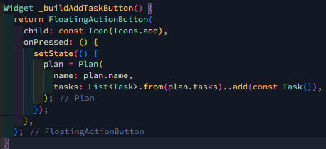 

## Langkah 8 : Buat method \_buildList 

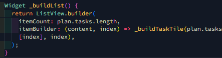 

## Langkah 9 : Buat method \_buildTaskTile 

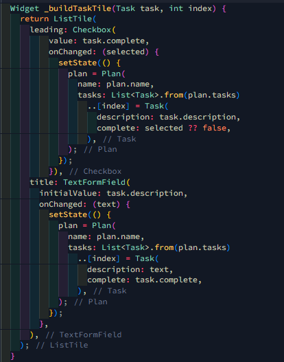 

## Langkah 10 : Tambah Scroll Controller 

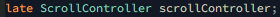 

## Langkah 11 : Tambah Scroll Listener 

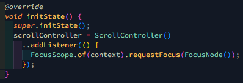 

## Langkah 12 : Tambah controller dan keyboard behavior 

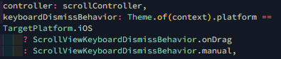 
