# Praktikum 1 : Dasar State dengan Model-View

## Langkah 1 : Buat Project Baru 

 

## Langkah 2 : Membuat model task.dart 

 

## Langkah 3 : Buat file plan.dart 

 

## Langkah 4 : Buat file data_layer.dart 

 

## Langkah 5 : Pindah ke file main.dart 

 

## Langkah 6 : Buat plan_screen.dart 

 

## Langkah 7 : buat method \_buildAddTaskButton 

 

## Langkah 8 : Buat method \_buildList 

 

## Langkah 9 : Buat method \_buildTaskTile 

 

## Langkah 10 : Tambah Scroll Controller 

 

## Langkah 11 : Tambah Scroll Listener 

 

## Langkah 12 : Tambah controller dan keyboard behavior 

 

## Langkah 13 : Terakhir, tambah method dispose 

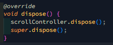 

## Langkah 14 : Hasil 

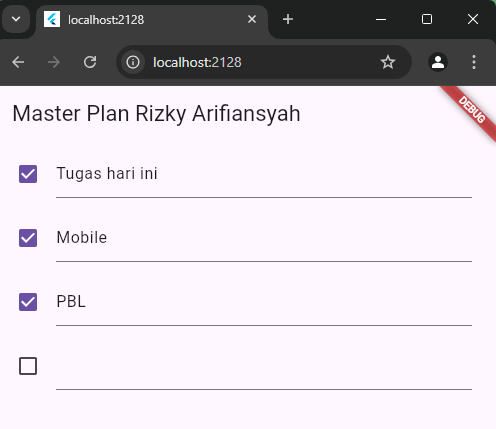 

## Tugas Praktikum 1 : Dasar State dengan Model-View 

1. Selesaikan langkah-langkah praktikum tersebut, lalu dokumentasikan berupa GIF hasil akhir praktikum beserta penjelasannya di file README.md! Jika Anda menemukan ada yang error atau tidak berjalan dengan baik, silakan diperbaiki.
2. Jelaskan maksud dari langkah 4 pada praktikum tersebut! Mengapa dilakukan demikian?
3. Mengapa perlu variabel plan di langkah 6 pada praktikum tersebut? Mengapa dibuat konstanta ?
4. Lakukan capture hasil dari Langkah 9 berupa GIF, kemudian jelaskan apa yang telah Anda buat!
5. Apa kegunaan method pada Langkah 11 dan 13 dalam lifecyle state ?
6. Kumpulkan laporan praktikum Anda berupa link commit atau repository GitHub ke spreadsheet yang telah disediakan!

# Praktikum 2 : Mengelola Data Layer dengan InheritedWidget dan InheritedNotifier 

## Langkah 1 : Buat file plan_provider.dart 

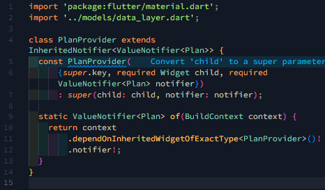 

## Langkah 2 : Edit main.dart 

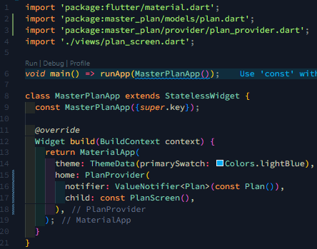 

## Langkah 3 : Tambah method pada plan.dart 

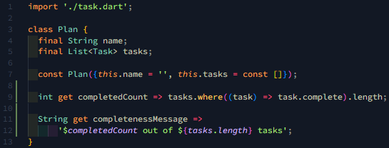 

## Langkah 4 dan 5 : Pindah ke PlanScreen dan Edit Method \_buildAddTaskButton 

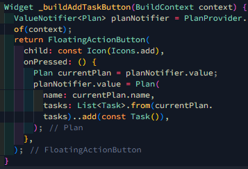 

## Langkah 6 : Edit method \_buildTaskTile 

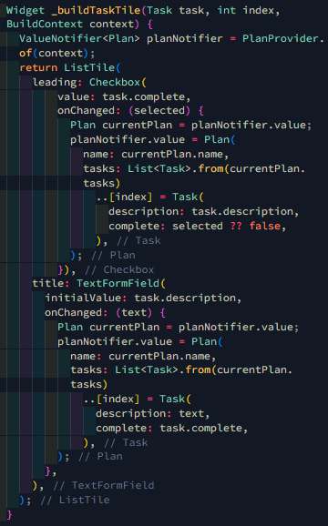 

## Langkah 7 : Edit \_buildList 

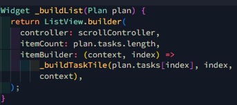 

## Langkah 8 dan 9 : Tetap di Class PlanScreen dan tambah widget safearea 

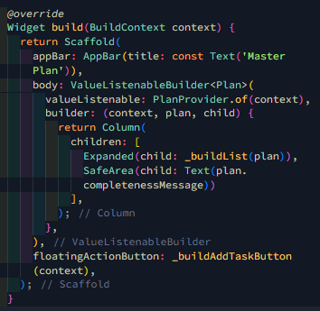 

## Tugas Praktikum 2 : InheritedWidget

1. Selesaikan langkah-langkah praktikum tersebut, lalu dokumentasikan berupa GIF hasil akhir praktikum beserta penjelasannya di file README.md! Jika Anda menemukan ada yang error atau tidak berjalan dengan baik, silakan diperbaiki sesuai dengan tujuan aplikasi tersebut dibuat.
2. Jelaskan mana yang dimaksud InheritedWidget pada langkah 1 tersebut! Mengapa yang digunakan InheritedNotifier?
3. Jelaskan maksud dari method di langkah 3 pada praktikum tersebut! Mengapa dilakukan demikian?
4. Lakukan capture hasil dari Langkah 9 berupa GIF, kemudian jelaskan apa yang telah Anda buat!
5. Kumpulkan laporan praktikum Anda berupa link commit atau repository GitHub ke spreadsheet yang telah disediakan!

## Praktikum 3 : Membuat State di Multiple Screens 

## Langkah 1 : Edit PlanProvider 

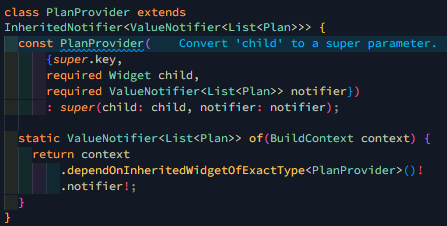 

## Langkah 2 : Edit main.dart 

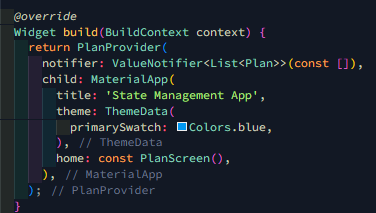 

## Langkah 3 : Edit plan_screen.dart 

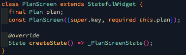 

## Langkah 4 dan 5 : error dan tambah getter plan 

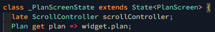 

## Langkah 6 : Method initState 

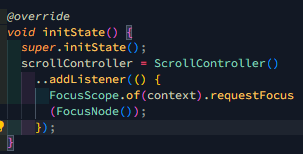 

## Langkah 7 : Widget build 

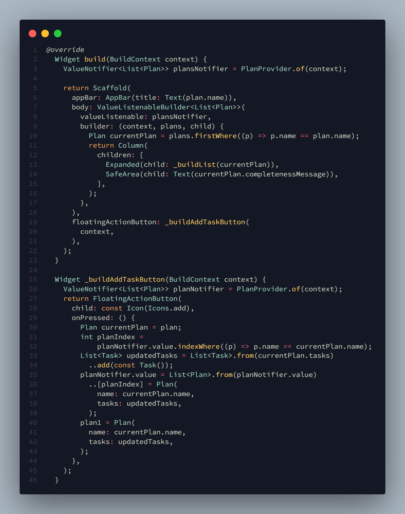 

## Langkah 8 : Edit \_buildTaskTile 

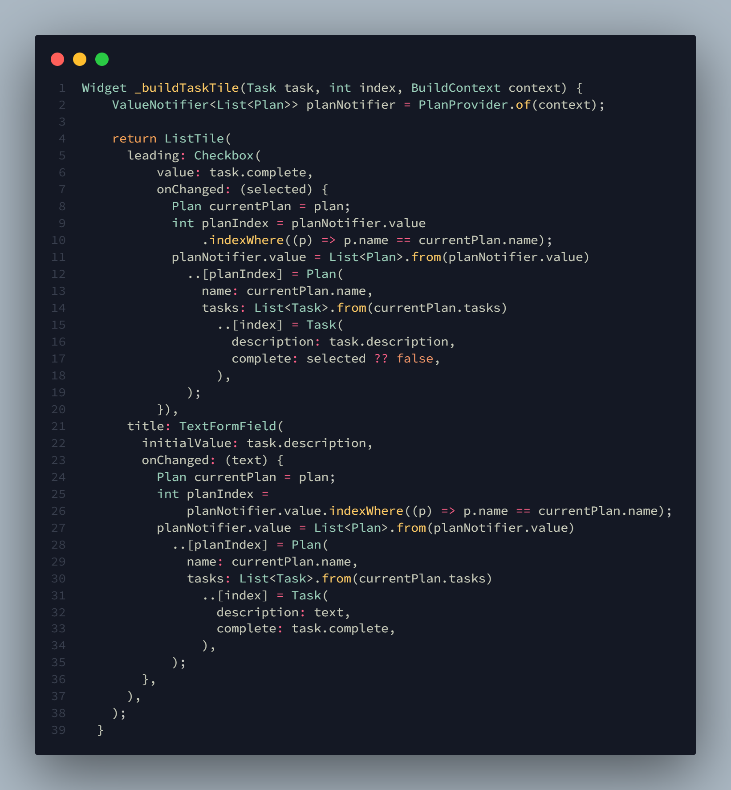 

## Langkah 9 : Buat Screen Baru 

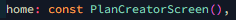 

## Langkah 10 : Pindah ke class \_PlanCreatorScreenState 

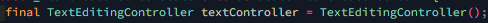 
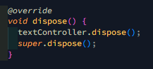 

## Langkah 11 : Pindah ke method build 

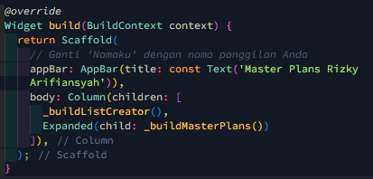 

## Langkah 12 : Buat widget \_buildListCreator 

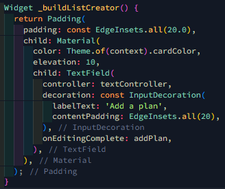 

## Langkah 13 : Buat void addPlan() 

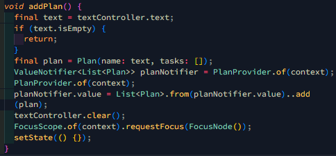 

## Langkah 14 : Buat widget \_buildMasterPlans() 

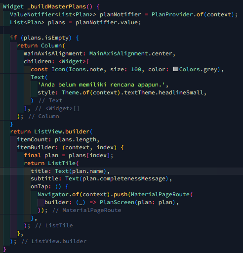 

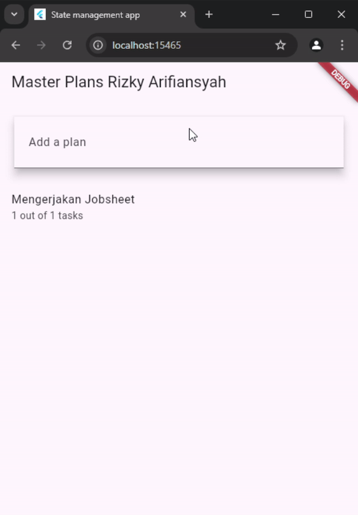 

## TUGAS

2. Berdasarkan Praktikum 3 yang telah Anda lakukan, jelaskan maksud dari gambar diagram berikut ini! 

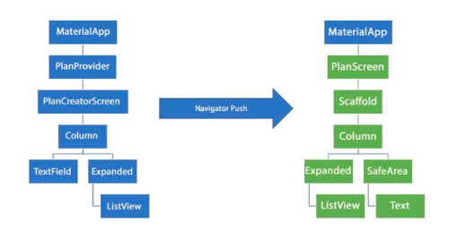 

Jawab :

- `Pengelolaan State`: Sebelum menggunakan Navigator Push, state management dilakukan menggunakan PlanProvider yang menyimpan state dan data. Setelah menggunakan Navigator Push, state management dapat lebih terpisah antar layar sehingga masing-masing layar dapat mengelola state-nya sendiri.
- `Navigasi dan Struktur Widget`: Dengan menggunakan Navigator Push, kita dapat memisahkan layar menjadi lebih modular dan terstruktur. Navigator Push memungkinkan transisi ke layar baru (PlanScreen) dengan struktur yang lebih rapi dan menggunakan widget seperti Scaffold dan SafeArea untuk meningkatkan tata letak dan keamanan tampilan.
  Navigator Push membantu dalam memisahkan logika dan tampilan antar layar, membuat aplikasi lebih mudah untuk di-maintain dan di-scale.
