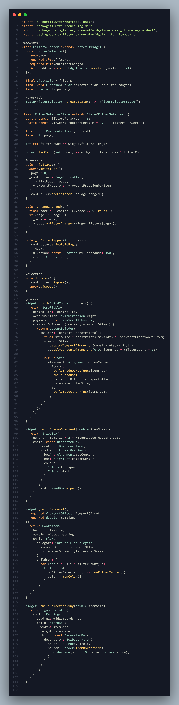
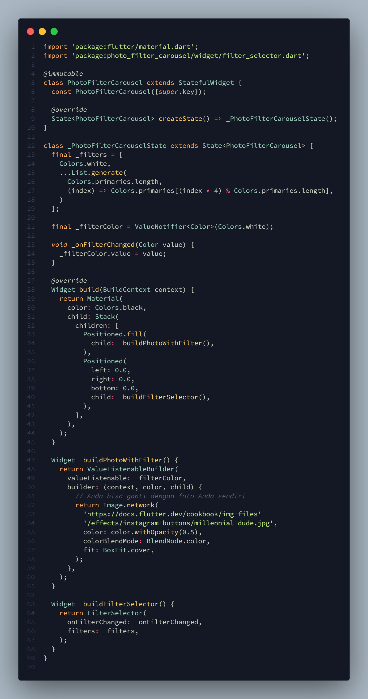
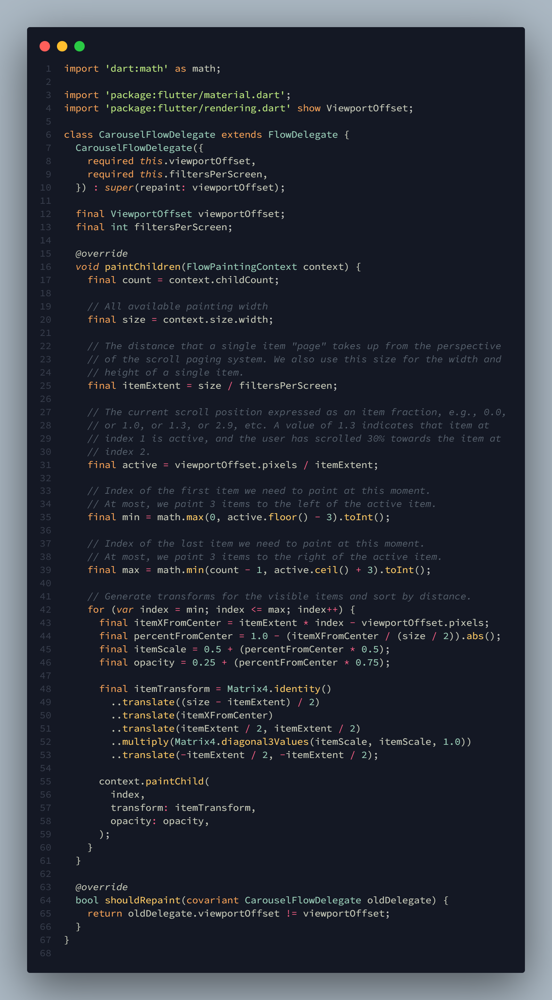
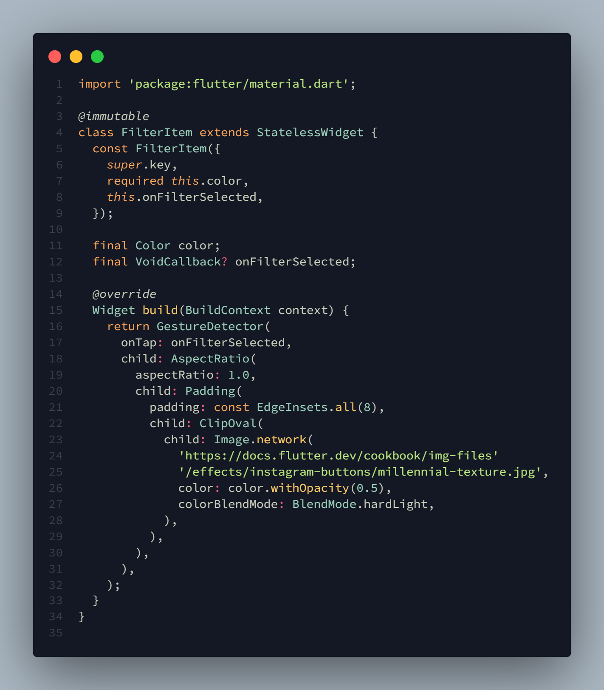
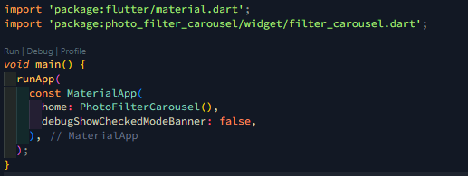

# Praktikum 2: membuat photo filter carousel

## Langkah 1: Buat Project baru 

## Langkah 2: Buat widget Selector ring dan dark gradient 

 

## Langkah 3: Buat widget photo filtre carousel 

 

## Langkah 4: Membuat filter warna - bagian 1 

 

## Langkah 5: Membuat filter warna 

 

## Langkah 6: Implementasi filter carousel 

 

# Tugas

1. Selesaikan Praktikum 1 dan 2, lalu dokumentasikan dan push ke repository Anda berupa screenshot setiap hasil pekerjaan beserta penjelasannya di file `README.md`! Jika terdapat error atau kode yang tidak dapat berjalan, silakan Anda perbaiki sesuai tujuan aplikasi dibuat!
2. Gabungkan hasil praktikum 1 dengan hasil praktikum 2 sehingga setelah melakukan pengambilan foto, dapat dibuat filter carouselnya!

Jawab :

Hasil: 

 

3. Jelaskan maksud `void async` pada praktikum 1?
   Jawab: Pada kode Future<void> main() async { ... }, Future<void> menunjukkan bahwa fungsi main adalah fungsi asynchronous yang mengembalikan sebuah objek Future yang tidak membawa nilai pengembalian (void). Keyword async menandai fungsi ini sebagai asynchronous, memungkinkan penggunaan keyword await di dalamnya untuk menunggu penyelesaian operasi asynchronous lainnya tanpa memblokir eksekusi program. Dengan kombinasi ini, fungsi main dapat melakukan operasi asynchronous secara efisien dan tetap menjaga program tetap responsif.

4. Jelaskan fungsi dari anotasi `@immutable` dan `@override` ?
   Jawab: Anotasi `@immutable` di Dart digunakan untuk menandai sebuah kelas sebagai immutable, yang berarti bahwa semua field dalam kelas tersebut harus bersifat final dan tidak dapat diubah setelah objek dibuat, membantu mencegah bug dan meningkatkan keamanan kode. Sementara itu, anotasi `@override` digunakan untuk menunjukkan bahwa sebuah metode di kelas turunan menimpa metode dengan nama yang sama di kelas induk, meningkatkan keterbacaan dan memastikan konsistensi implementasi metode serta membantu alat pengembangan dan kompiler dalam mendeteksi ketidaksesuaian.

5. Kumpulkan link commit repository GitHub Anda kepada dosen yang telah disepakati!
