# Praktikum 1: Dart Streams 

## Langkah 1: Buat Project Baru 

## Langkah 2: Buka file main.dart 

### Soal 1: Tambahkan nama panggilan Anda pada title app sebagai identitas hasil pekerjaan Anda. Gantilah warna tema aplikasi sesuai kesukaan Anda. 

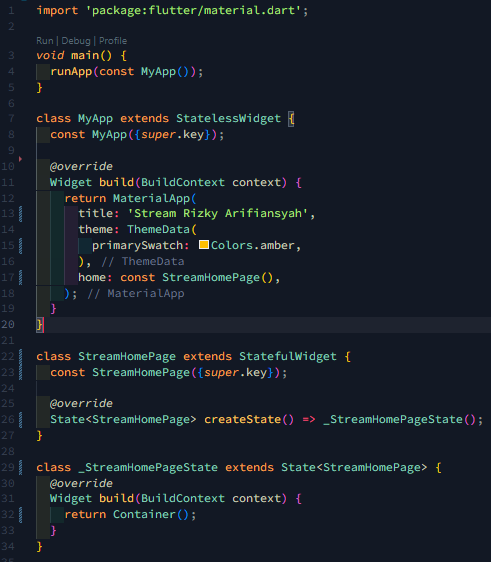 

## Langkah 3: Buat file baru stream.dart 

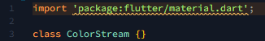 

## Langkah 4: Tambah variable colors 

### Soal 2: Tambahkan 5 warna lainnya sesuai keinginan Anda pada variabel colors tersebut. 

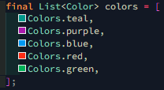 

## Langkah 5: Tambah method getColors 

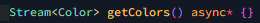 

## Langkah 6: Tambah perintah yield\* 

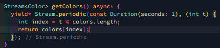 

### Soal 3:

- Jelaskan fungsi keyword yield\* pada kode tersebut! 
  Jawab: yield* adalah keyword dalam Dart yang digunakan untuk melimpahkan kontrol ke aliran (stream) lain dan mengirimkan semua event (data, error, atau done) dari stream tersebut ke stream yang sedang dibuat. Dalam konteks kode ini, yield* digunakan untuk menghasilkan nilai secara periodik dari aliran yang dibuat oleh Stream.periodic. 
- Apa maksud isi perintah kode tersebut? 
  Jawab: Kode tersebut mendefinisikan sebuah kelas ColorStream yang memiliki sebuah list colors berisi beberapa warna. Metode getColors adalah generator stream yang mengembalikan sebuah stream dari warna-warna tersebut. Stream.periodic digunakan untuk membuat event baru setiap satu detik, yang kemudian mengirimkan salah satu warna dari list colors. Penggunaan (int t) di Stream.periodic memungkinkan kita untuk mengakses indeks waktu yang sedang berjalan, dan dengan menggunakan operasi modulus (%), indeks ini dipetakan kembali ke rentang indeks yang valid dari list colors. Hasilnya adalah stream yang secara bergantian mengirimkan warna-warna dari list tersebut setiap satu detik.

## Langkah 7: Buka main.dart 

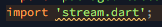 

## Langkah 8: Tambah variabel 

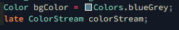 

## Langkah 9: Tambah method changeColor() 

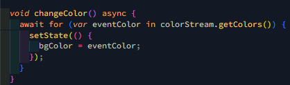 

## Langkah 10: Lakukan override initState() 

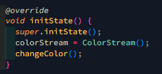 

## Langkah 11: Ubah isi Scaffold() 

 

## Langkah 12: Run 

### Soal 4: Capture hasil praktikum Anda berupa GIF dan lampirkan di README. 

 

## Langkah 13: Ganti isi method changeColor() 

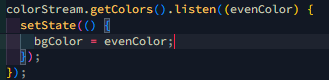 

### Soal 5: Jelaskan perbedaan menggunakan listen dan await for (langkah 9) 

Jawab: Perbedaan utama antara keduanya adalah bahwa await for bersifat blocking, menunggu dan memproses setiap elemen stream satu per satu, sedangkan listen bersifat non-blocking, langsung melanjutkan eksekusi dan menangani elemen stream melalui callback. await for lebih cocok ketika perlu memastikan setiap elemen stream diproses secara berurutan, sementara listen lebih baik digunakan ketika ingin segera memproses elemen stream tanpa menunggu elemen berikutnya.

# Praktikum 2: Stream Controller dan sinks 

## Langkah 1: Buka file stream.dart 

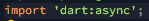 

## Langkah 2: Tambah class NumberStream 

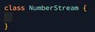 

## Langkah 3: Tambah StreamController 

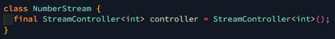 

## Langkah 4: Tambah method addNumberToSink 

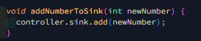 

## Langkah 5: Tambah method close() 

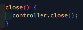 

## Langkah 6: Buka main.dart 

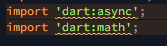 

## Langkah 7: Tambah variabel 

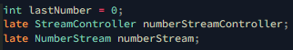 

## Langkah 8: Edit initState() 

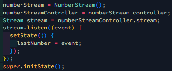 

## Langkah 9: Edit dispose() 

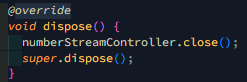 

## Langkah 10: Tambah method addRandomNumber() 

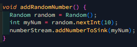 

## Langkah 11: Edit method build() 

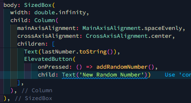 

## Langkah 12: Run 

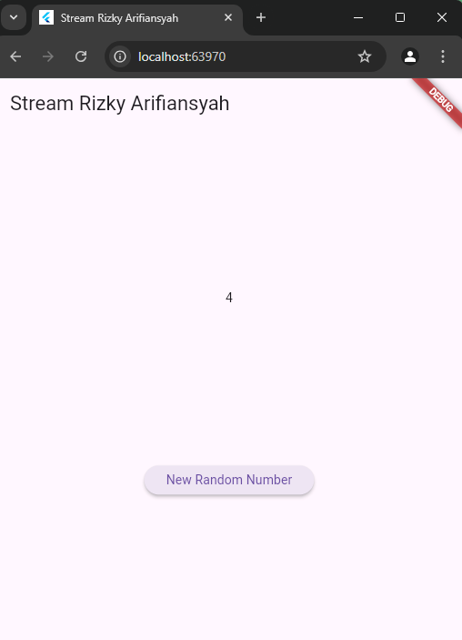 

### Soal 6 Jelaskan maksud kode langkah 8 dan 10 tersebut! 

Jawab: Pada metode initState, NumberStream diinisialisasi dan stream dari numberStreamController diambil. Listener didaftarkan pada stream ini untuk memperbarui state widget dengan nilai terbaru dari stream setiap kali data baru diterima, menggunakan setState untuk mengubah lastNumber. Pada metode addRandomNumber, sebuah angka acak antara 0 dan 9 dihasilkan menggunakan instance dari kelas Random, kemudian angka tersebut ditambahkan ke dalam stream melalui addNumberToSink dari NumberStream, yang akan memicu listener yang terdaftar di initState untuk memperbarui state widget dengan nilai baru.

## Langkah 13: Buka stream.dart 

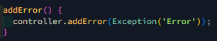 

## Langkah 14: Buka main.dart 

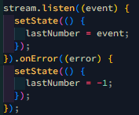 

## Langkah 15: Edit method addRandomNumber() 

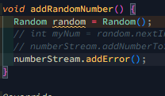 

### Soal 7 Jelaskan maksud kode langkah 13 sampai 15 tersebut!

Jawab: Fungsi addError mengirimkan error (Exception('Error')) ke stream menggunakan controller.addError, yang memicu listener onError terdaftar pada stream. Listener stream diatur untuk memperbarui state widget dengan nilai event terbaru melalui setState yang mengubah lastNumber setiap kali ada data baru yang masuk. Jika terjadi error, listener onError akan mengatur lastNumber menjadi -1. Fungsi addRandomNumber, yang biasanya digunakan untuk menambahkan angka acak ke stream, dalam versi ini diubah untuk memanggil numberStream.addError sehingga error dikirimkan ke stream dan ditangani oleh listener onError.

# Praktikum 3: Injeksi data ke streams 

## Langkah 1: Buka main.dart 

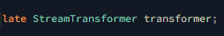 

## Langkah 2: Tambahkan kode ini di initState 

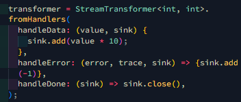 

## Langkah 3: Tetap di initState 

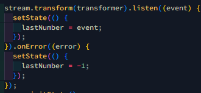 

## Langkah 4: Run 

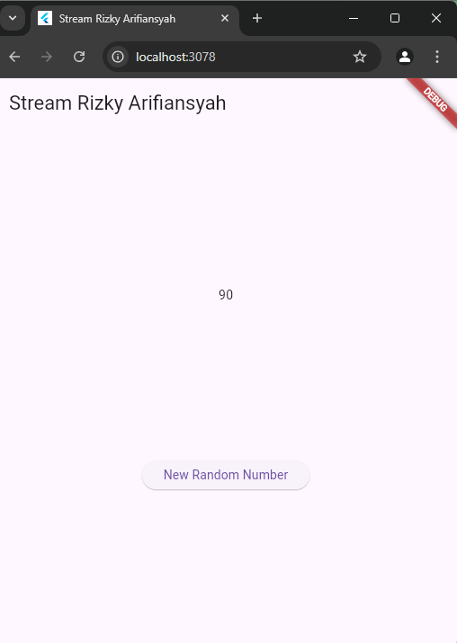 

### Soal 8 Jelaskan maksud kode langkah 1-3 tersebut!

Jawab: Kode ini menunjukkan bagaimana menggunakan StreamTransformer untuk memodifikasi data yang mengalir melalui stream dan bagaimana menangani data serta error dalam listener pada aplikasi Flutter. StreamTransformer dideklarasikan dengan handler untuk menangani data, error, dan penyelesaian stream, di mana setiap nilai data yang diterima dikalikan dengan 10, dan jika terjadi error, nilai -1 ditambahkan ke sink. Stream yang telah ditransformasikan dengan transformer didengarkan menggunakan listener, yang memperbarui state widget dengan nilai event terbaru melalui setState, mengatur lastNumber menjadi nilai yang telah dikalikan dengan 10, atau menjadi -1 jika terjadi error. Listener pada stream yang telah ditransformasikan memperbarui state widget dengan nilai event terbaru atau mengatur lastNumber menjadi -1 jika terjadi error. Metode initState dari superclass (State) dipanggil setelah inisialisasi selesai.
