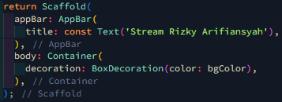

# Praktikum 1: Dart Streams 

## Langkah 1: Buat Project Baru 

## Langkah 2: Buka file main.dart 

### Soal 1: Tambahkan nama panggilan Anda pada title app sebagai identitas hasil pekerjaan Anda. Gantilah warna tema aplikasi sesuai kesukaan Anda. 

 

## Langkah 3: Buat file baru stream.dart 

 

## Langkah 4: Tambah variable colors 

### Soal 2: Tambahkan 5 warna lainnya sesuai keinginan Anda pada variabel colors tersebut. 

 

## Langkah 5: Tambah method getColors 

 

## Langkah 6: Tambah perintah yield\* 

 

### Soal 3:

- Jelaskan fungsi keyword yield\* pada kode tersebut! 
  Jawab: yield* adalah keyword dalam Dart yang digunakan untuk melimpahkan kontrol ke aliran (stream) lain dan mengirimkan semua event (data, error, atau done) dari stream tersebut ke stream yang sedang dibuat. Dalam konteks kode ini, yield* digunakan untuk menghasilkan nilai secara periodik dari aliran yang dibuat oleh Stream.periodic. 
- Apa maksud isi perintah kode tersebut? 
  Jawab: Kode tersebut mendefinisikan sebuah kelas ColorStream yang memiliki sebuah list colors berisi beberapa warna. Metode getColors adalah generator stream yang mengembalikan sebuah stream dari warna-warna tersebut. Stream.periodic digunakan untuk membuat event baru setiap satu detik, yang kemudian mengirimkan salah satu warna dari list colors. Penggunaan (int t) di Stream.periodic memungkinkan kita untuk mengakses indeks waktu yang sedang berjalan, dan dengan menggunakan operasi modulus (%), indeks ini dipetakan kembali ke rentang indeks yang valid dari list colors. Hasilnya adalah stream yang secara bergantian mengirimkan warna-warna dari list tersebut setiap satu detik.

## Langkah 7: Buka main.dart 

 

## Langkah 8: Tambah variabel 

 

## Langkah 9: Tambah method changeColor() 

 

## Langkah 10: Lakukan override initState() 

 

## Langkah 11: Ubah isi Scaffold() 

 

## Langkah 12: Run 

### Soal 4: Capture hasil praktikum Anda berupa GIF dan lampirkan di README. 

 

## Langkah 13: Ganti isi method changeColor() 

 

### Soal 5: Jelaskan perbedaan menggunakan listen dan await for (langkah 9) 

Jawab: Perbedaan utama antara keduanya adalah bahwa await for bersifat blocking, menunggu dan memproses setiap elemen stream satu per satu, sedangkan listen bersifat non-blocking, langsung melanjutkan eksekusi dan menangani elemen stream melalui callback. await for lebih cocok ketika perlu memastikan setiap elemen stream diproses secara berurutan, sementara listen lebih baik digunakan ketika ingin segera memproses elemen stream tanpa menunggu elemen berikutnya.
